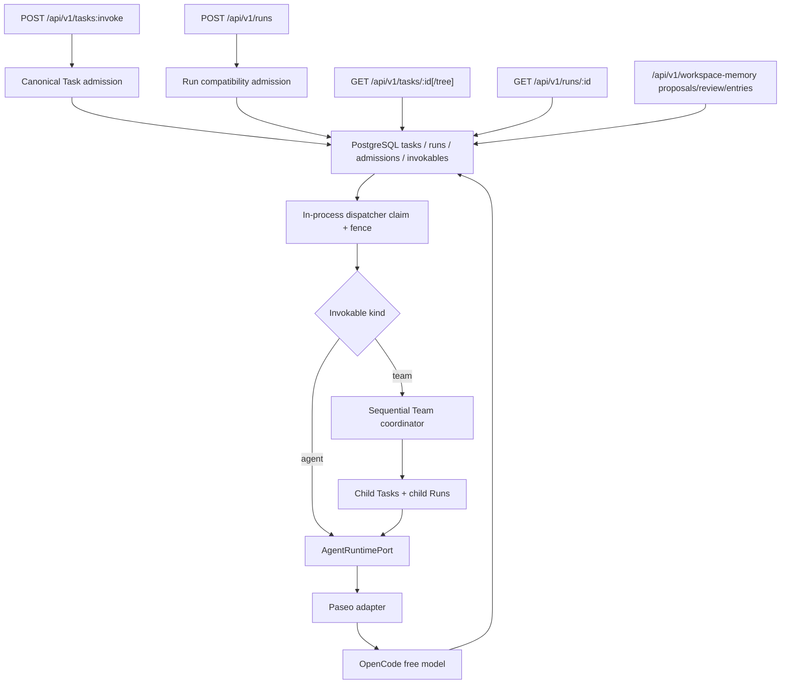

# Agent Server

Agent Server is an enterprise control-plane project for long-lived agents and bounded agent teams. Paseo remains the leaf-agent runtime; this repository owns stable product identities, task/run semantics, policy, evidence, channels, and durable orchestration around it.

The current repository is a **walking-skeleton baseline with the first durable kernel slice and a sequential Team MVP**, not the V1 platform. It proves one replaceable path end to end:



## Baseline status

| Capability                                     | Current state                                                            |
| ---------------------------------------------- | ------------------------------------------------------------------------ |
| HTTP liveness/readiness                        | Implemented                                                              |
| Asynchronous Run API                           | Implemented                                                              |
| Authenticated service-account Run ingress      | Implemented                                                              |
| Canonical Task invoke/read/tree API            | Implemented                                                              |
| Owner-scoped Run reads                         | Implemented                                                              |
| PostgreSQL-backed Task/Run admission           | Implemented                                                              |
| Durable Agent/Team definitions and versions    | Implemented                                                              |
| Sequential Team graph compilation              | Implemented; sequential-only subset                                      |
| Sequential Team child Task/Run execution       | Implemented; inline control-plane path                                   |
| Owner-scoped idempotent replay                 | Implemented                                                              |
| In-process durable dispatcher/claim/fence      | Implemented; single process                                              |
| Paseo WebSocket adapter                        | Implemented                                                              |
| OpenCode free-model discovery                  | Implemented                                                              |
| Explicit reusable Paseo Workspace              | Implemented                                                              |
| Workspace memory proposals/review/entries      | Implemented; governance-only baseline                                    |
| Deterministic CI                               | Implemented; no model network calls                                      |
| Zero-model-credential external smoke           | Implemented; optional/manual/scheduled                                   |
| Managed Environment API + ProductSession pin   | Implemented baseline; four authenticated routes, RuntimeSession/Cell MVE |
| Managed Single-Agent V1 evidence               | Minimum scenario approved; hardening deferred                            |
| OIDC users, shared ACLs, credentials, approval | Planned V1                                                               |
| Artifacts, evidence, Web console               | Planned V1                                                               |
| Fixed Lark command + Card/Doc canary           | Implemented and verified; fixed compatibility-only, not production       |

## Quick start

Requirements: Node.js 22–24, Corepack, Linux or macOS on x64/arm64, PostgreSQL reachable via `DATABASE_URL` or `POSTGRES_URL` for API startup, configured `SERVICE_ACCOUNTS_JSON` bindings for authenticated API use, and network access for the real OpenCode smoke.

```bash
make setup
make ci
make paseo-smoke
```

`make ci` is deterministic and does not call an external model. `make paseo-smoke` starts isolated Paseo, a local PGlite-backed PostgreSQL socket, and Agent Server processes, allowlists only non-secret runtime/network environment variables, dynamically selects an explicitly free OpenCode model, and expects the exact marker `PASEO_OPENCODE_BASELINE_OK`.

Start the local stack:

```bash
make dev
```

`make dev`, `make dev-api`, and `pnpm start` require `DATABASE_URL` or `POSTGRES_URL`.

Submit and poll a run:

```bash
export SERVICE_ACCOUNTS_JSON='[{"serviceAccountId":"svc_local","token":"token-local-dev","tenantId":"tenant_local","workspaceId":"workspace_main","policyVersion":"policy-local"}]'

curl -sS http://127.0.0.1:3000/api/v1/runs \
  -H 'authorization: Bearer token-local-dev' \
  -H 'content-type: application/json' \
  -d '{"prompt":"Reply with exactly: HELLO"}'

curl -sS http://127.0.0.1:3000/api/v1/runs/<run_id> \
  -H 'authorization: Bearer token-local-dev'
```

`/api/v1/runs` remains the compatibility API, but it is no longer the only public Task ingress. Both Run and Task routes require `Authorization: Bearer ...`. Admission persists a canonical root Task plus the first Run in PostgreSQL, deriving owner scope from the authenticated service account rather than caller-supplied tenant or principal fields. The Run compatibility API does not accept a caller-selected model. Operators may set `PASEO_MODEL`; otherwise the adapter chooses from the live catalog and never automatically falls back to an unmarked paid model.

The canonical public Task surface is:

- `POST /api/v1/tasks:invoke`
- `GET /api/v1/tasks/{id}`
- `GET /api/v1/tasks/{id}/tree`

The Managed Environment baseline adds authenticated validate/import/read/publish
routes for one fixed Paseo/OpenCode/free-only package. ProductSession creation
pins its published EnvironmentVersion; first use creates one internal
RuntimeSession, launch snapshot, and derived Runtime Cell. This is not a
production isolation or full Runtime Session V2 claim.

These routes invoke a published `agent` or `team` version and return Task identity plus owner-scoped read links. There are still no public `/api/v1/agents` or `/api/v1/teams` write/read endpoints in this phase; durable Agent/Team versions exist in PostgreSQL and are consumed by the control plane.

The workspace-memory governance surface is:

- `POST /api/v1/workspace-memory/proposals`
- `GET /api/v1/workspace-memory/proposals`
- `POST /api/v1/workspace-memory/proposals/{proposal_id}/review`
- `GET /api/v1/workspace-memory/entries`

These routes let the authenticated owner scope create memory proposals, review them by accepting, editing-and-accepting, or rejecting, and list accepted entries with source provenance. This is not agent memory or retrieval: this phase does not add embeddings, vector search, ranking, runtime context injection, or automatic prompt mutation.

## Canonical commands

| Command            | Purpose                                                             |
| ------------------ | ------------------------------------------------------------------- |
| `make setup`       | Install locked dependencies and verify the platform OpenCode binary |
| `make dev`         | Start isolated Paseo plus the API                                   |
| `make dev-api`     | Start only the API; Paseo must already be available                 |
| `make check`       | Types, formatting, documentation, and Exec Plan checks              |
| `make test`        | Unit, contract, and component-integration tests                     |
| `make e2e-smoke`   | Real HTTP socket with a deterministic fake runtime                  |
| `make paseo-smoke` | Real Paseo/OpenCode/free-model external smoke                       |
| `make ci`          | All deterministic pull-request gates                                |
| `make clean`       | Remove generated and isolated local output                          |

## Documentation map

- [Product](docs/product.md): users, value, scope, and release boundary.
- [Features](docs/features.md): authoritative capability ledger and status.
- [Components](docs/components.md): ownership and implementation boundaries.
- [Architecture](docs/architecture.md): domain, execution, recovery, and security direction.
- [Contracts](docs/contracts.md): Run compatibility, Task, health, runtime, and invokable registry interfaces.
- [Managed Environment API](docs/contracts/managed-environment-api.md): fixed Environment package, Session pin, RuntimeSession/Cell semantics, and non-goals.
- [Quality](docs/quality.md): test taxonomy, release gates, and evidence.
- [Operations](docs/operations.md): local development and incident runbook.
- [Managed Single-Agent V1 runbook](docs/operations/managed-single-agent-v1-runbook.md): draft A–H happy path, recovery boundary, and escalation.
- [Managed Single-Agent V1 evidence packet](docs/evidence/managed-single-agent-v1-evidence-packet.md): approved minimum-scenario evidence; production hardening deferred.
- [Lark Managed Memory command canary evidence](docs/evidence/lark-managed-memory-command-canary-evidence-packet.md): sanitized fixed-configuration command-path evidence.
- [Lark Managed Memory Card/Doc evidence](docs/evidence/lark-managed-memory-card-doc-canary-evidence-packet.md): sanitized normal-path provider evidence and boundaries.
- [Lark Managed Memory command canary runbook](docs/operations/lark-memory-command-canary-runbook.md): safe readiness, one-consumer operation, command/Card/Doc verification, and shutdown.
- [Decisions](docs/decisions.md): accepted architectural decisions.
- [Agent handbook](docs/agents.md): mandatory workflow for coding agents.
- [Exec Plans](docs/exec-plans.md): active-to-completed work protocol.
- [Roadmap](docs/roadmap.md): sequence from this baseline to V1.

The repository documentation is self-contained. The legacy `backup` branch and external research may be consulted as evidence, but neither is an implementation dependency or a source to copy wholesale.

## Baseline limitations

- Baseline authentication is limited to configured service-account bearer tokens on the public Run and Task APIs.
- The baseline still lacks end-user OIDC, shared Workspace ACLs, credential broker/tool approvals, execution-cell isolation, cancel, retry, streaming, and artifact services.
- Managed Runtime Cells are an implemented MVE placement seam, not production isolation; transaction concurrency, crash recovery, legacy nullable Sessions, Grant renewal/header persistence, Host placement/GC, and a second adapter remain deferred.
- Execution still uses one in-process dispatcher loop; this phase does not add multi-worker coordination or reconcile workers.
- `/api/v1/runs` remains a compatibility API; canonical Task invocation now lives on `/api/v1/tasks:invoke` and Task reads on `/api/v1/tasks/{id}` plus `/tree`.
- Team execution is intentionally sequential-only. This phase does not implement join, approval, retry, reconcile, shared Team runtime sessions, or artifact lineage.
- Durable Agent/Team definitions and published versions exist, but public `/api/v1/agents` and `/api/v1/teams` management routes are not implemented yet.
- Free OpenCode models and their availability can change; therefore the external smoke is not a required pull-request gate.
- The adapter exposes only the minimum contract required to prove the seam. V1 runtime compatibility work is tracked in the roadmap.
- Workspace memory is governance-only in this phase. Accepted entries are persisted and listable, but agents do not read them automatically and no retrieval, embedding/vector search, or runtime context assembly is implemented.
- The Lark baseline is a fixed compatibility canary only: one App/group/user
  and service-account tuple, command/Card/Doc projection surfaces, no canonical
  Lark identity, and no production delivery, physical exactly-once, multi-node,
  or full crash-recovery claim. Thread command remains the fallback surface.

See [Security](SECURITY.md) before deploying or connecting real credentials. This baseline is for local development and architecture validation only.
