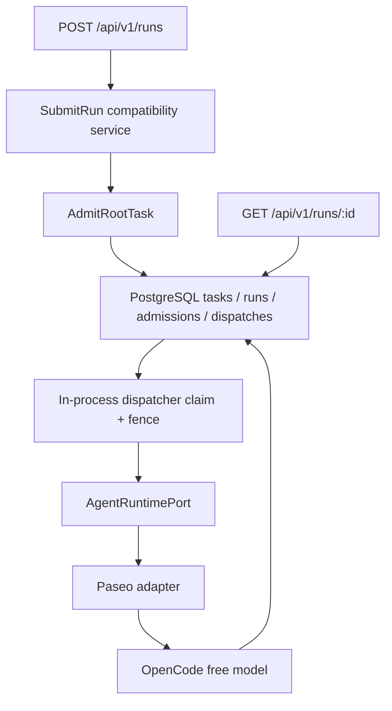

# Agent Server

Agent Server is an enterprise control-plane project for long-lived agents and bounded agent teams. Paseo remains the leaf-agent runtime; this repository owns stable product identities, task/run semantics, policy, evidence, channels, and durable orchestration around it.

The current repository is a **walking-skeleton baseline with the first durable kernel slice**, not the V1 platform. It proves one replaceable path end to end:



## Baseline status

| Capability                                     | Current state                          |
| ---------------------------------------------- | -------------------------------------- |
| HTTP liveness/readiness                        | Implemented                            |
| Asynchronous Run API                           | Implemented                            |
| Authenticated service-account Run ingress      | Implemented                            |
| Owner-scoped Run reads                         | Implemented                            |
| PostgreSQL-backed Task/Run admission           | Implemented                            |
| Owner-scoped idempotent replay                 | Implemented                            |
| In-process durable dispatcher/claim/fence      | Implemented; single process            |
| Paseo WebSocket adapter                        | Implemented                            |
| OpenCode free-model discovery                  | Implemented                            |
| Explicit reusable Paseo Workspace              | Implemented                            |
| Deterministic CI                               | Implemented; no model network calls    |
| Zero-model-credential external smoke           | Implemented; optional/manual/scheduled |
| OIDC users, shared ACLs, credentials, approval | Planned V1                             |
| Agent/Team definitions and graph execution     | Planned V1                             |
| Artifacts, evidence, Lark, Web console         | Planned V1                             |

## Quick start

Requirements: Node.js 22–24, Corepack, Linux or macOS on x64/arm64, PostgreSQL reachable via `DATABASE_URL` or `POSTGRES_URL` for API startup, configured `SERVICE_ACCOUNTS_JSON` bindings for authenticated API use, and network access for the real OpenCode smoke.

```bash
make setup
make ci
make paseo-smoke
```

`make ci` is deterministic and does not call an external model. `make paseo-smoke` starts isolated Paseo, a local PGlite-backed PostgreSQL socket, and Agent Server processes, allowlists only non-secret runtime/network environment variables, dynamically selects an explicitly free OpenCode model, and expects the exact marker `PASEO_OPENCODE_BASELINE_OK`.

Start the local stack:

```bash
make dev
```

`make dev`, `make dev-api`, and `pnpm start` require `DATABASE_URL` or `POSTGRES_URL`.

Submit and poll a run:

```bash
export SERVICE_ACCOUNTS_JSON='[{"serviceAccountId":"svc_local","token":"token-local-dev","tenantId":"tenant_local","workspaceId":"workspace_main","policyVersion":"policy-local"}]'

curl -sS http://127.0.0.1:3000/api/v1/runs \
  -H 'authorization: Bearer token-local-dev' \
  -H 'content-type: application/json' \
  -d '{"prompt":"Reply with exactly: HELLO"}'

curl -sS http://127.0.0.1:3000/api/v1/runs/<run_id> \
  -H 'authorization: Bearer token-local-dev'
```

The public HTTP surface remains `/api/v1/runs`, but both `POST` and `GET` now require `Authorization: Bearer ...`. Admission persists a canonical root Task plus the first compatibility Run in PostgreSQL, deriving owner scope from the authenticated service account rather than caller-supplied tenant or principal fields. The API does not accept a caller-selected model. Operators may set `PASEO_MODEL`; otherwise the adapter chooses from the live catalog and never automatically falls back to an unmarked paid model.

## Canonical commands

| Command            | Purpose                                                             |
| ------------------ | ------------------------------------------------------------------- |
| `make setup`       | Install locked dependencies and verify the platform OpenCode binary |
| `make dev`         | Start isolated Paseo plus the API                                   |
| `make dev-api`     | Start only the API; Paseo must already be available                 |
| `make check`       | Types, formatting, documentation, and Exec Plan checks              |
| `make test`        | Unit, contract, and component-integration tests                     |
| `make e2e-smoke`   | Real HTTP socket with a deterministic fake runtime                  |
| `make paseo-smoke` | Real Paseo/OpenCode/free-model external smoke                       |
| `make ci`          | All deterministic pull-request gates                                |
| `make clean`       | Remove generated and isolated local output                          |

## Documentation map

- [Product](docs/product.md): users, value, scope, and release boundary.
- [Features](docs/features.md): authoritative capability ledger and status.
- [Components](docs/components.md): ownership and implementation boundaries.
- [Architecture](docs/architecture.md): domain, execution, recovery, and security direction.
- [Contracts](docs/contracts.md): Run, health, and runtime interfaces.
- [Quality](docs/quality.md): test taxonomy, release gates, and evidence.
- [Operations](docs/operations.md): local development and incident runbook.
- [Decisions](docs/decisions.md): accepted architectural decisions.
- [Agent handbook](docs/agents.md): mandatory workflow for coding agents.
- [Exec Plans](docs/exec-plans.md): active-to-completed work protocol.
- [Roadmap](docs/roadmap.md): sequence from this baseline to V1.

The repository documentation is self-contained. The legacy `backup` branch and external research may be consulted as evidence, but neither is an implementation dependency or a source to copy wholesale.

## Baseline limitations

- Baseline authentication is limited to configured service-account bearer tokens on the Run compatibility API.
- The baseline still lacks end-user OIDC, shared Workspace ACLs, credential broker/tool approvals, execution-cell isolation, cancel, retry, streaming, and artifact services.
- Execution still uses one in-process dispatcher loop; this phase does not add multi-worker coordination or reconcile workers.
- `/api/v1/runs` is still the only public invocation surface; canonical Task routes are not exposed yet.
- Free OpenCode models and their availability can change; therefore the external smoke is not a required pull-request gate.
- The adapter exposes only the minimum contract required to prove the seam. V1 runtime compatibility work is tracked in the roadmap.

See [Security](SECURITY.md) before deploying or connecting real credentials. This baseline is for local development and architecture validation only.
