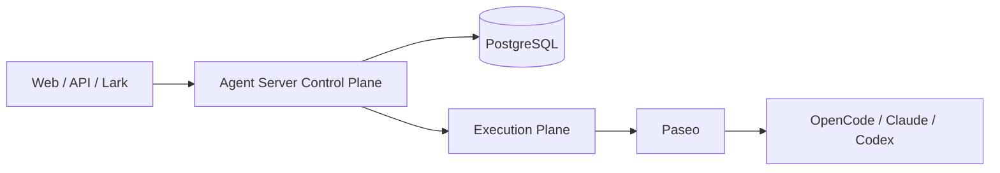

# Agent Server

Agent Server is an enterprise control plane for long-lived Agents and bounded Agent Teams. Paseo is the current first-class execution plane; Agent Server owns product identity, Task/Run semantics, policy, durable orchestration, memory governance, channels, and product-facing projections around it.

The repository is in **Prove / MVE-first** development. The development harness is intentionally optimized for fast deterministic feedback: the host/sandbox is the isolation boundary, PGlite is the default test database, local PostgreSQL is used only when real PostgreSQL semantics matter, and real providers are explicit canaries.

## Architecture at a glance



`Task` is the canonical invocation and `Run` is an execution attempt. Agent Teams coordinate durable Team state in Agent Server; leaf Agent work is delegated through the execution boundary.

## Quick start — host native

Prerequisites:

- Node 22–24 and pnpm 11;
- no PostgreSQL installation is required;
- `createdb` is optional and lets setup create the real default database automatically.

Install and prepare the development database:

```bash
corepack enable
pnpm install --frozen-lockfile
pnpm setup
pnpm setup:providers   # optional; required for host-native runtime work
pnpm doctor
```

When reachable, the default real database is:

```text
postgresql://$USER@127.0.0.1:5432/agent_server_dev
```

Set `DATABASE_URL` when the local database uses a different user, password, host, port, or name. `pnpm setup` is idempotent: it creates local working directories, creates the database when possible, and applies durable migrations.

If no explicit `DATABASE_URL`/`POSTGRES_URL` is set and local PostgreSQL is absent, setup starts or reuses a persistent PGlite wire server at `127.0.0.1:55432` under `.local/dev-runtime` and applies the same migrations. Set `PGLITE_PORT` when that port is occupied. Explicit database URLs still require reachable real PostgreSQL.

Start normal core development without Docker or a provider:

```bash
pnpm dev
```

This starts:

```text
Agent Server API  http://127.0.0.1:3000
Web               http://127.0.0.1:3001
Runtime           disabled
```

Core mode uses the deterministic direct-chat mock and leaves Product Work execution absent, so resource/API/UI work does not depend on Paseo or a live model.

When the change actually needs the execution plane, load provider credentials and run:

```bash
pnpm setup:providers
pnpm dev:runtime
```

The pinned provider toolchain requires Linux and `flock`; use the Linux
development sandbox for host-native runtime preparation. Core development does
not require provider installation.

`dev:runtime` starts the same host-native API/Web topology and uses the existing host-native Paseo helper for the runtime process. It also runs the idempotent Web bootstrap after the API becomes ready.

## Developer doctor

```bash
pnpm doctor
```

Doctor reports separate readiness for:

- core development;
- deterministic scenarios;
- real-runtime work.

Missing Paseo/provider capability is a warning for core development rather than a reason to block unrelated product work.

## Deterministic verification

The default test command does **not** require Docker, Paseo, provider credentials, or a browser:

```bash
pnpm test
```

Canonical lanes:

```bash
pnpm test:unit
pnpm test:contract
pnpm test:integration
pnpm test:repository
pnpm test:scenario
```

`test:scenario` runs the deterministic North Star product journey with real Agent Server handlers/repositories and a scripted runtime decision boundary. `test:north-star` remains a compatibility alias.

Run the normal repository gate:

```bash
pnpm check
pnpm verify
```

`verify` is deterministic. Browser/real-provider/product-world checks stay explicit.

## Real PostgreSQL semantics

Most repository and scenario coverage uses PGlite. Use a dedicated local PostgreSQL database only for behavior PGlite should not pretend to prove, for example:

- `FOR UPDATE` / `SKIP LOCKED`;
- advisory locks;
- connection/transaction races;
- PostgreSQL-only indexes/constraints;
- real migration concurrency.

Create a dedicated test database and opt in:

```bash
createdb agent_server_test
TEST_DATABASE_URL=postgresql://$USER@127.0.0.1:5432/agent_server_test pnpm test:pg
```

If `TEST_DATABASE_URL` / `INTEGRATION_DATABASE_URL` is unset, `pnpm test:pg` prints a skip message and exits successfully. The runner refuses database names that do not contain `test` and refuses production-flavored names such as `prod`, `production`, `main`, or `live`.

`pnpm test:real-pg` remains a compatibility alias for `pnpm test:pg`.

## Scenario harness

Reusable scenario composition lives under `tests/harness/`:

```text
tests/harness/
├── agent-server-harness.ts
├── database.ts
├── postgres.ts
├── scripted-runtime.ts
└── seed/
```

Use semantic fixtures (`seed.workspace`, `seed.agentVersion`, `seed.teamVersion`, `seed.workDefinition`, `seed.goldenPath`) rather than repeating table-shaped SQL in product scenarios. Production handlers and repositories remain real; only the probabilistic model/runtime decision boundary is scripted.

Background workers expose deterministic `step()` seams. Production loops repeatedly call `step()` and sleep after an idle result; tests call `step()` directly instead of starting infinite loops and waiting on timers.

## Explicit canaries

Real external compatibility is deliberately separate from software correctness:

```bash
pnpm canary:runtime
pnpm canary:golden-path
```

- `canary:runtime` starts the host-native runtime topology and runs the bounded real-provider runtime smoke.
- `canary:golden-path` starts host-native API/Web/runtime and runs the representative browser product path.

Provider availability, prompt/tool choice, and external runtime behavior are canary concerns; deterministic product wiring belongs in `test:scenario`.

## Docker / production-like topology

Docker Compose remains supported, but it is no longer the ordinary development entrypoint:

```bash
pnpm dev:docker
pnpm dev:docker:runtime
pnpm dev:docker:full
pnpm acceptance:run
```

`config/local-environments.yaml` and `tooling/environment/` remain the production-like/CI/acceptance topology harness. Use them when container topology itself is what you need to validate, not as a prerequisite for editing or testing Agent Server inside an already isolated sandbox.

## Tests, fixtures, evals, canaries, acceptance

These concerns are intentionally separate:

- **Tests**: deterministic software assertions.
- **Fixtures/Harness**: semantic setup and deterministic composition used by tests.
- **Evals**: persistent Agent/model-quality measurements under `evals/`.
- **Canaries**: a small set of live runtime/product compatibility checks.
- **Acceptance**: production-like topology and milestone/release evidence.

See [Testing and evaluations](docs/quality/testing-and-evaluations.md) and [Development](docs/development.md).

## Repository map

```text
src/                    product/runtime implementation
apps/web/               product Web UI
tests/harness/           reusable deterministic scenario harness
tests/                  contract/integration/repository/scenario checks
e2e/                    explicit browser/process E2E
evals/                  Agent/model quality evaluation
tooling/dev/             host-native developer harness
tooling/environment/     Docker/production-like topology harness
scripts/dev/             reusable runtime/bootstrap helpers
scripts/smoke/           small real external main flows
scripts/ops/             migration/recovery/operator utilities
config/                  checked-in configuration
docs/                    durable product/engineering documentation
```

## Documentation map

- [Development](docs/development.md)
- [Product](docs/product.md)
- [Features](docs/features.md)
- [Components](docs/components.md)
- [Architecture](docs/architecture.md)
- [Contracts](docs/contracts.md)
- [Quality](docs/quality.md)
- [Testing and evaluations](docs/quality/testing-and-evaluations.md)
- [Operations](docs/operations.md)
- [Decisions](docs/decisions.md)
- [Agent handbook](docs/agents.md)
- [Roadmap](docs/roadmap.md)

Repository documentation must remain usable without private Drive access. External research and project Roadmaps/Decisions may guide work, but current code plus durable repository docs define the checked-in implementation.

## Development-stage limitations

This is not a production-ready platform. Broader identity/ACL hardening, stronger runtime isolation, generalized production recovery, production credential brokerage, and broader Artifact services remain separate product-hardening concerns. They do not justify making the ordinary developer feedback loop depend on a production-like container topology or a live model.

See [Security](SECURITY.md) before connecting real credentials or deploying outside an isolated development environment.
