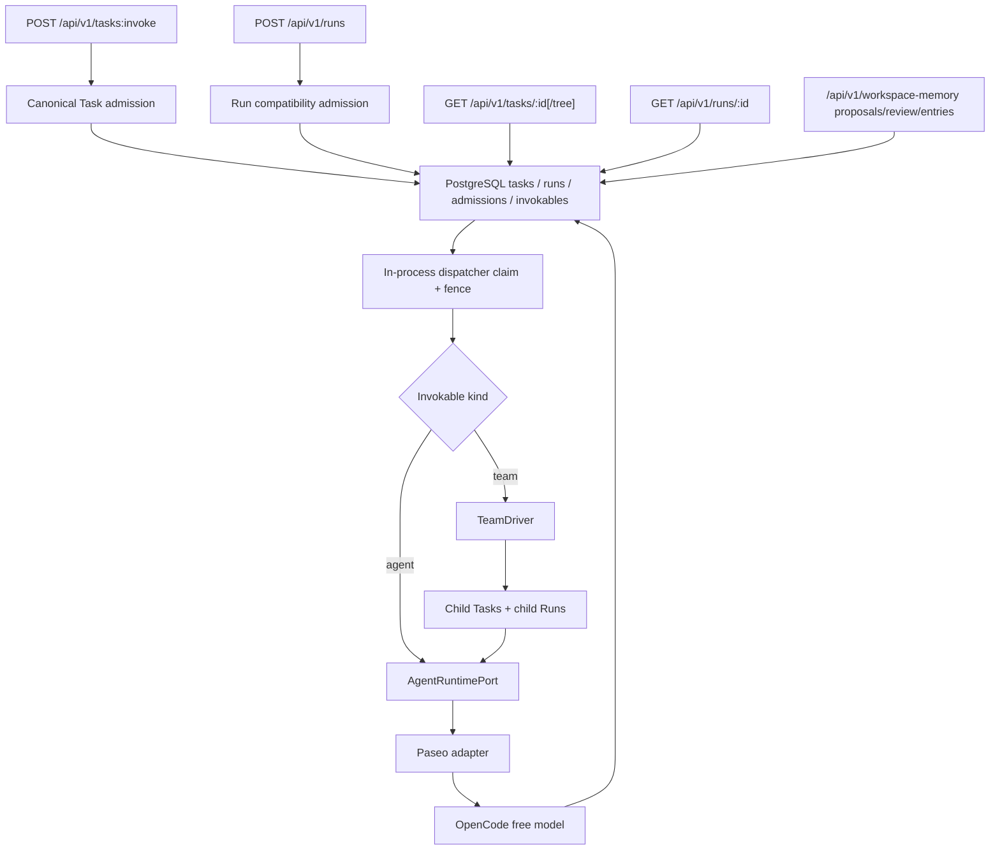

# Agent Server

Agent Server is an enterprise control-plane project for long-lived agents and bounded agent teams. Paseo remains the leaf-agent runtime; this repository owns stable product identities, task/run semantics, policy, evidence, channels, and durable orchestration around it.

The current repository is a **walking-skeleton baseline with Agent Teams v2**,
not the V1 platform. Its Team path is one fixed-roster, durable coordination
loop driven by `TeamDriver`:



## Baseline status

| Capability                                     | Current state                                                                                                                                           |
| ---------------------------------------------- | ------------------------------------------------------------------------------------------------------------------------------------------------------- |
| HTTP liveness/readiness                        | Implemented                                                                                                                                             |
| Asynchronous Run API                           | Implemented                                                                                                                                             |
| Authenticated service-account Run ingress      | Implemented                                                                                                                                             |
| Canonical Task invoke/read/tree API            | Implemented                                                                                                                                             |
| Owner-scoped Run reads                         | Implemented                                                                                                                                             |
| PostgreSQL-backed Task/Run admission           | Implemented                                                                                                                                             |
| Durable Agent/Team definitions and versions    | Implemented                                                                                                                                             |
| Agent Teams v2 coordination                    | Implemented; fixed TeamVersion, TeamDriver, TeamRun, MemberRun, Work, and TeamMessage state                                                             |
| Team child Task/Run execution                  | Implemented; bounded Lead turns, work attempts, and addressed member continuations                                                                      |
| Owner-scoped idempotent replay                 | Implemented                                                                                                                                             |
| In-process durable dispatcher/claim/fence      | Implemented; single process                                                                                                                             |
| Paseo WebSocket adapter                        | Implemented                                                                                                                                             |
| OpenCode free-model discovery                  | Implemented                                                                                                                                             |
| Explicit reusable Paseo Workspace              | Implemented                                                                                                                                             |
| Workspace memory proposals/review/entries      | Implemented; governance-only baseline                                                                                                                   |
| Deterministic CI                               | Implemented; no model network calls                                                                                                                     |
| Zero-model-credential external smoke           | Implemented; optional/manual/scheduled                                                                                                                  |
| Managed Environment API + ProductSession pin   | Implemented baseline; four authenticated routes, RuntimeSession/Cell MVE                                                                                |
| Managed Single-Agent V1 evidence               | Minimum scenario approved; hardening deferred                                                                                                           |
| Web Chat + Paseo rich-events MVE               | Implemented MVE; sanitized direct timeline/disclosures and replay verified; Oracle merge-ready; PR integration pending                                  |
| Self-learning Project Lab MVE                  | Implemented local/single-operator MVE; fixed Project/Team, human-reviewed LearningProposal to canonical Memory CAS, and refreshable observation surface |
| OIDC users, shared ACLs, credentials, approval | Planned V1                                                                                                                                              |
| Artifacts, evidence, broader Web console       | Planned V1                                                                                                                                              |
| Fixed Lark command + Card/Doc canary           | Implemented and verified; fixed compatibility-only, not production                                                                                      |

## Quick start

Supported local development is Docker-first. Requirements are Docker Compose
with a running daemon, network access for image/package installation and the
real OpenCode smoke, and Linux or macOS on x64/arm64. The image supplies Node
`24.18.0`, pnpm `11.7.0`, Paseo `0.1.110`, and OpenCode `1.18.4`.

```bash
make setup
```

Use the command for the representative path you are changing. The following are
available scoped or merge/release verification commands, not a default sequence
for every Prove-stage slice:

```bash
make ci
make paseo-smoke
make managed-environment-smoke
make agent-teams-v2-smoke
```

These commands run in one-shot Docker runner containers; `make ci` is
deterministic and does not call an external model. `make paseo-smoke` runs the
baseline external smoke inside the image and expects
`PASEO_OPENCODE_BASELINE_OK`. The Managed Environment smoke uses the ephemeral
`postgres-test` Compose profile and expects `MANAGED_ENVIRONMENT_MVE_OK`.

Docker-first one-shot commands use `scripts/dev/docker-run [--postgres]
[--pass-env NAME ...] -- COMMAND [ARG...]`. It forwards no host environment by
default; each `--pass-env` name is validated and forwarded explicitly. With
`--postgres`, it starts and waits for the private `postgres-test` service,
injects in-network `DATABASE_URL`, `POSTGRES_URL`, and `POSTGRES_ADMIN_URL`,
then removes only the service it started. It does not mount host `HOME`, expose
database ports, or use the Docker socket. The wrapper is for isolated commands;
`make dev` remains the persistent-stack capability boundary.

For the Agent Teams v2 main-flow smoke, set
`PASEO_MODEL=opencode-go/deepseek-v4-flash` and export `OPENCODE_GO_API_KEY`
from a local mode-0600 environment file. The Docker target allowlists only
the model, key, and documented v2 timeout settings; the key is never logged.

Start the local stack:

```bash
make dev
```

`make dev` starts the persistent PostgreSQL service and the complete isolated
Agent Server container. `make dev-api` is a compatibility alias for the same
stack. Only `127.0.0.1:3000:3000` is published on the host; PostgreSQL, Paseo,
OpenCode, and Runtime MCP have no host-published ports. Native diagnostics are
explicitly named `*-native` and are not the supported default.

The local Web Chat MVE uses a separate Next.js service and same-origin BFF. Run
`make web-bootstrap` to validate/import/publish the fixed local Agent and
Environment inputs through authenticated APIs, then `make web-dev` to build and
start the Web service with the local stack. The browser receives only the
HttpOnly `product_session_id`; the Agent Server bearer remains server-side.
This is a fresh-ProductSession local MVE path, not a production Web console.
Activity is rendered as sanitized collapsible root and direct-child timeline
disclosures for live and replayed Run Events; completed root rows default
closed. Production identity, recovery, and broader console behavior remain
deferred.

The Agent Teams v2 smoke is a fixed local/single-operator path. It activates a
published Team Version, proves Lead/member Work coordination and an addressed
TeamMessage continuation, then verifies its bounded owner-scoped projection:

```bash
PASEO_MODEL=opencode-go/deepseek-v4-flash \
make agent-teams-v2-smoke
```

The paid model environment is optional when an explicitly free model is
available; see the local development and operations runbooks for prerequisites
and retained visual-evidence mode. This MVE is not a production or multi-user
authentication boundary.

Submit and poll a run:

```bash
export SERVICE_ACCOUNTS_JSON='[{"serviceAccountId":"svc_local","token":"token-local-dev","tenantId":"tenant_local","workspaceId":"workspace_main","policyVersion":"policy-local"}]'

curl -sS http://127.0.0.1:3000/api/v1/runs \
  -H 'authorization: Bearer token-local-dev' \
  -H 'content-type: application/json' \
  -d '{"prompt":"Reply with exactly: HELLO"}'

curl -sS http://127.0.0.1:3000/api/v1/runs/<run_id> \
  -H 'authorization: Bearer token-local-dev'
```

`/api/v1/runs` remains the compatibility API, but it is no longer the only public Task ingress. Both Run and Task routes require `Authorization: Bearer ...`. Admission persists a canonical root Task plus the first Run in PostgreSQL, deriving owner scope from the authenticated service account rather than caller-supplied tenant or principal fields. The Run compatibility API does not accept a caller-selected model. Operators may set `PASEO_MODEL`; otherwise the adapter chooses from the live catalog and never automatically falls back to an unmarked paid model.

The canonical public Task surface is:

- `POST /api/v1/tasks:invoke`
- `GET /api/v1/tasks/{id}`
- `GET /api/v1/tasks/{id}/tree`

The Managed Environment baseline adds authenticated validate/import/read/publish
routes for one fixed Paseo/OpenCode/free-only package. ProductSession creation
pins its published EnvironmentVersion; first use creates one internal
RuntimeSession, launch snapshot, and derived Runtime Cell. This is not a
production isolation or full Runtime Session V2 claim.

These routes invoke a published `agent` or `team` version and return Task identity plus owner-scoped read links. Managed Agent/Team registry routes cover validate/import/read/list/publish. Agent Teams v2 reads expose the owner-scoped TeamRun, MemberRun, Work, and direct TeamMessage records created by `TeamDriver`.

The workspace-memory governance surface is:

- `POST /api/v1/workspace-memory/proposals`
- `GET /api/v1/workspace-memory/proposals`
- `POST /api/v1/workspace-memory/proposals/{proposal_id}/review`
- `GET /api/v1/workspace-memory/entries`

These routes let the authenticated owner scope create memory proposals, review them by accepting, editing-and-accepting, or rejecting, and list accepted entries with source provenance. This is not agent memory or retrieval: this phase does not add embeddings, vector search, ranking, runtime context injection, or automatic prompt mutation.

## Canonical commands

| Command                          | Purpose                                                        |
| -------------------------------- | -------------------------------------------------------------- |
| `make setup`                     | Build the image and verify the Linux OpenCode binary           |
| `make dev`                       | Start PostgreSQL plus the complete isolated Agent Server stack |
| `make dev-api`                   | Compatibility alias for `make dev`                             |
| `make check`                     | Types, formatting, documentation, and Exec Plan checks         |
| `make test`                      | Unit, contract, and component-integration tests                |
| `make e2e-smoke`                 | Real HTTP socket with a deterministic fake runtime             |
| `make paseo-smoke`               | Real Paseo/OpenCode/free-model external smoke                  |
| `make managed-environment-smoke` | Three-turn Managed Environment smoke in Docker                 |
| `make agent-teams-v2-smoke`      | Agent Teams v2 main-flow smoke in Docker                       |
| `make ci`                        | All deterministic pull-request gates                           |
| `make clean`                     | Stop Compose services without deleting named volumes           |

## Documentation map

- [Product](docs/product.md): users, value, scope, and release boundary.
- [Features](docs/features.md): authoritative capability ledger and status.
- [Components](docs/components.md): ownership and implementation boundaries.
- [Architecture](docs/architecture.md): domain, execution, recovery, and security direction.
- [Contracts](docs/contracts.md): Run compatibility, Task, health, runtime, and invokable registry interfaces.
- [Managed Environment API](docs/contracts/managed-environment-api.md): fixed Environment package, Session pin, RuntimeSession/Cell semantics, and non-goals.
- [Agent Teams v2 Web API](docs/contracts/self-learning-web-api.md): fixed Team BFF launch, aggregate, safe errors, and local-only boundary.
- [Self-learning managed agent team MVE evidence](docs/evidence/self-learning-managed-agent-team-mve-evidence-packet.md): sanitized Phase 1–3 and final acceptance evidence; production hardening deferred.
- [Quality](docs/quality.md): test taxonomy, release gates, and evidence.
- [Operations](docs/operations.md): local development and incident runbook.
- [Managed Single-Agent V1 runbook](docs/operations/managed-single-agent-v1-runbook.md): draft A–H happy path, recovery boundary, and escalation.
- [Managed Single-Agent V1 evidence packet](docs/evidence/managed-single-agent-v1-evidence-packet.md): approved minimum-scenario evidence; production hardening deferred.
- [Web Chat + Paseo Streaming MVE evidence packet](docs/evidence/web-chat-paseo-streaming-mve-evidence-packet.md): sanitized fresh-session browser evidence; production hardening deferred.
- [Web Chat rich-events MVE evidence packet](docs/evidence/web-chat-rich-events-mve-evidence-packet.md): sanitized real-session evidence for safe progress, Tool, usage, Markdown, and refresh recovery.
- [Lark Managed Memory command canary evidence](docs/evidence/lark-managed-memory-command-canary-evidence-packet.md): sanitized fixed-configuration command-path evidence.
- [Lark Managed Memory Card/Doc evidence](docs/evidence/lark-managed-memory-card-doc-canary-evidence-packet.md): sanitized normal-path provider evidence and boundaries.
- [Lark Managed Memory command canary runbook](docs/operations/lark-memory-command-canary-runbook.md): safe readiness, one-consumer operation, command/Card/Doc verification, and shutdown.
- [Decisions](docs/decisions.md): accepted architectural decisions.
- [Agent handbook](docs/agents.md): mandatory workflow for coding agents.
- [Exec Plans](docs/exec-plans.md): active-to-completed work protocol.
- [Roadmap](docs/roadmap.md): sequence from this baseline to V1.

The repository documentation is self-contained. The legacy `backup` branch and external research may be consulted as evidence, but neither is an implementation dependency or a source to copy wholesale.

## Baseline limitations

- Baseline authentication is limited to configured service-account bearer tokens on the public Run and Task APIs.
- The baseline still lacks end-user OIDC, shared Workspace ACLs, credential broker/tool approvals, production execution-cell isolation, cancel/retry UI, and artifact services. The narrow fresh-session Web Chat rich-events MVE is implemented and verified locally; production recovery and broader console behavior remain deferred.
- Managed Runtime Cells are an implemented MVE placement seam, not production isolation; transaction concurrency, crash recovery, legacy nullable Sessions, Grant renewal/header persistence, Host placement/GC, and a second adapter remain deferred.
- Execution still uses one in-process dispatcher loop; this phase does not add multi-worker coordination or reconcile workers.
- `/api/v1/runs` remains a compatibility API; canonical Task invocation now lives on `/api/v1/tasks:invoke` and Task reads on `/api/v1/tasks/{id}` plus `/tree`.
- Public callers still invoke Teams through `/api/v1/tasks:invoke` and inspect the Task tree/status; no generalized public Team CRUD/API was added.
- The implemented owner-scoped Team registry routes are limited to validate/import/read/list/publish; they are distinct from the Task invocation route. Agent Teams v2 coordinates durable TeamRun, MemberRun, Work, and TeamMessage records. Every Lead turn, work attempt, and addressed wake is a child Task/Run; members execute with independent RuntimeSessions.
- Agent Teams v2 has a fixed roster and bounded Work lifecycle. Dynamic rosters, nested Teams, generalized graph execution, recovery, retry, cancellation propagation, and production readiness are not claimed.
- Free OpenCode models and their availability can change; therefore the external smoke is not a required pull-request gate.
- The adapter exposes only the minimum contract required to prove the seam. V1 runtime compatibility work is tracked in the roadmap.
- Workspace memory is governance-only in this phase. Accepted entries are persisted and listable, but agents do not read them automatically and no retrieval, embedding/vector search, or runtime context assembly is implemented.
- The Lark baseline is a fixed compatibility canary only: one App/group/user
  and service-account tuple, command/Card/Doc projection surfaces, no canonical
  Lark identity, and no production delivery, physical exactly-once, multi-node,
  or full crash-recovery claim. Thread command remains the fallback surface.

See [Security](SECURITY.md) before deploying or connecting real credentials. This baseline is for local development and architecture validation only.
