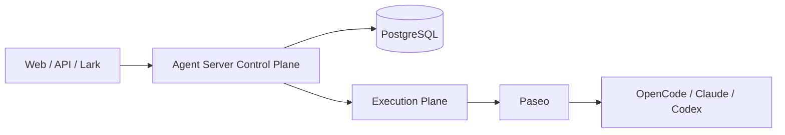

# Agent Server

Agent Server is an enterprise control plane for long-lived Agents and bounded Agent Teams. Paseo is the current first-class execution plane; Agent Server owns product identity, Task/Run semantics, policy, durable orchestration, memory governance, channels, and product-facing projections around it.

The repository is still in **Prove / MVE-first** development. The goal is to validate complete product paths before production hardening.

## Architecture at a glance



`Task` is the canonical invocation and `Run` is an execution attempt. Agent Teams coordinate durable Team state in Agent Server; leaf Agent work is delegated through the execution boundary.

## Repository command surface

This is a Node/TypeScript repository. **pnpm is the only command surface.** There is no Makefile and repository workflows call package scripts directly.

Install dependencies:

```bash
corepack enable
pnpm install --frozen-lockfile
```

Fast deterministic development commands:

```bash
pnpm typecheck
pnpm test:unit
pnpm test:contract
pnpm test:integration
pnpm test:repository
```

Run the deterministic repository gate:

```bash
pnpm check
```

Run the full deterministic CI set locally when appropriate:

```bash
pnpm ci
```

`pnpm ci` includes deterministic E2E but does not require a live model. Browser-specific tests remain explicit through `pnpm test:web` and `pnpm test:e2e:web`.

## Local environments

Development and infrastructure-backed tests share the topology definitions in `config/local-environments.yaml`.

Stable topologies are:

| Topology | Services |
| --- | --- |
| `in-process` | Node + PGlite/fakes only |
| `postgres` | disposable real PostgreSQL |
| `core` | PostgreSQL + Agent Server, no execution plane |
| `runtime` | PostgreSQL + Agent Server + Paseo |
| `full` | runtime topology + Web |

Start an interactive environment:

```bash
pnpm env -- up core
pnpm env -- up runtime
pnpm env -- info
pnpm env -- down
```

For a one-off command that needs infrastructure, use the same environment library instead of creating a scenario script:

```bash
pnpm env -- run postgres -- <command>
pnpm env -- run runtime -- <command>
```

The command gets isolated infrastructure, useful URLs/DB variables, and automatic cleanup. Generated diagnostics are written under ignored `.local/test-runs/<run-id>/`; failed runs can be retained with `TEST_KEEP_FAILED=1`.

Real PostgreSQL integration tests are self-contained:

```bash
pnpm test:real-pg
```

If `DATABASE_URL`/`POSTGRES_URL` is not already supplied, the test support layer starts and cleans up a disposable PostgreSQL topology automatically.

## External runtime smoke

Real provider checks are explicit opt-in verification, never an ordinary deterministic gate. Load credentials from an external file or secret source; do not commit them.

```bash
set -a; . /path/to/provider.env; set +a
pnpm smoke:runtime
```

A canonical bounded Team smoke is also available:

```bash
pnpm smoke:agent-team
```

These commands use the generic environment runner. If a future test or smoke is difficult to start, improve the shared environment/fixture APIs instead of adding a task-specific setup script.

## Tests, fixtures, evals, and smoke

The repository deliberately separates four concerns:

- **Tests**: deterministic software assertions (`src/**/*.test.ts`, `tests/`, `e2e/`).
- **Fixtures**: typed builders or stable serialized protocol samples consumed by tests.
- **Evals**: persistent Agent/model-quality evaluation under `evals/`.
- **Smoke**: a very small set of real external main-flow checks under `scripts/smoke/`.

Generated logs, screenshots, recordings, one-run API captures, mutation output, and task handoff artifacts are not repository source. Git/PR history and CI artifacts preserve development history; HEAD contains durable product/engineering truth.

## Repository map

```text
src/                    product/runtime implementation
apps/web/               product Web UI
modules and tooling     composition and engineering support
tests/                  unit support, contract, integration, repository checks
e2e/                    deterministic end-to-end tests
evals/                  Agent/model quality evaluation
scripts/dev/             durable local-development helpers
scripts/smoke/           small real external main flows
scripts/ops/             migration/recovery/operator utilities
tooling/environment/     shared local/test environment lifecycle
config/                  stable checked-in configuration
docs/                    durable product/engineering documentation
```

## Documentation map

- [Product](docs/product.md)
- [Features](docs/features.md)
- [Components](docs/components.md)
- [Architecture](docs/architecture.md)
- [Contracts](docs/contracts.md)
- [Quality](docs/quality.md)
- [Operations](docs/operations.md)
- [Decisions](docs/decisions.md)
- [Agent handbook](docs/agents.md)
- [Roadmap](docs/roadmap.md)

The repository documentation must remain usable without private Drive access. External research and project Roadmaps/Decisions may guide work, but current code plus durable repository docs define the checked-in implementation.

## Development-stage limitations

This is not a production-ready platform. Important hardening remains deferred, including broader identity/ACL work, stronger runtime isolation, multi-worker recovery/reconciliation, generalized cancellation/retry UX, production credential brokerage, and broader Artifact services. Real provider availability can also change and therefore is not a pull-request prerequisite.

See [Security](SECURITY.md) before connecting real credentials or deploying outside an isolated development environment.
