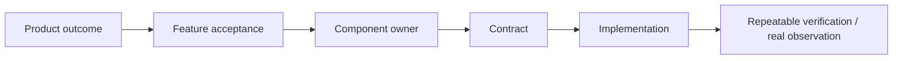

# Repository orientation

## First entry

1. Read root `AGENTS.md` and `README.md`.
2. Check the current branch/working tree and understand the requested outcome.
3. Read Product/Feature status plus the relevant Component and Contract.
4. Trace the representative path from its real entry point through the changed boundary to its observable result.
5. Inspect current code instead of assuming a documented target is already implemented.

## Trace model



## Code map

- `src/domain`: framework-free state and invariants.
- `src/application`: use cases and ports.
- `src/adapters`: execution/external-system translations.
- `src/infrastructure`: storage and infrastructure implementations.
- `src/entrypoints`: HTTP/channel/CLI entrypoints.
- `tests/contract`: public response/error/validation behavior.
- `tests/integration`: component/datastore boundaries.
- `tests/support`: reusable environment and fixture support.
- `tests/repository`: small structural repository invariants.
- `e2e`: deterministic process/socket behavior.
- `evals`: Agent/model-quality evaluation.
- `tooling/environment`: shared Dev/Test topology lifecycle.
- `scripts/dev`, `scripts/smoke`, `scripts/ops`: the only durable script categories.

## Repository boundaries

Do not copy legacy implementation or task artifacts into the current tree. External private documents are design inputs, not runtime/contributor dependencies. All instructions required to work must remain available in the repository.

Generated output is never a source artifact. Use `.local/test-runs/<run-id>/` or CI artifacts.

## Useful commands

```bash
git status --short --branch
rg "term or contract" docs src tests e2e
pnpm typecheck
pnpm test:unit
pnpm local-env info runtime
```

Use focused discovery. Avoid broad destructive cleanup, package upgrades, or speculative infrastructure before the relevant boundary is understood.
