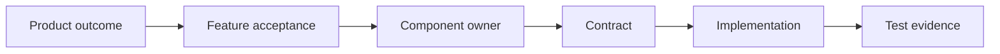

# Repository orientation

## First entry

1. Read root `AGENTS.md` and `README.md`.
2. Check working-tree status and current branch before opening files.
3. List `docs/exec-plans/active/`; identify ownership and overlapping paths.
4. Read Product and Feature status, then the relevant Component and Contract.
5. Trace from contract to application port/use case, adapter/infrastructure, and tests.
6. Run the smallest existing test that establishes the current baseline.

## Trace model



A code path without Feature/Contract context may be scaffolding rather than a supported capability. A documented target without code/test evidence remains planned.

## Code map

- `src/domain`: invariant-rich, framework-free product types.
- `src/application`: use cases plus ports named in product language.
- `src/adapters`: external system translation, currently Paseo.
- `src/infrastructure`: storage/operations implementations, currently memory.
- `src/entrypoints`: HTTP routes and future channel adapters.
- `tests/contract`: public response/error/validation behavior.
- `tests/integration`: real components around fake external seams.
- `e2e`: deterministic process/socket-level behavior.
- `scripts/dev` and `scripts/smoke`: local process orchestration and external evidence.

## Repository boundaries

The default branch began empty. `backup` is read-only behavioral evidence: do not copy implementation, API, shared Workspace, Session store, or permission shortcuts. External private documents are design inputs, not runtime or contributor dependencies. All instructions required to work must live here.

## Conflict and dirty-tree check

Do not overwrite or stage unexplained changes. Identify which files belong to the current plan, whether another Active Plan names them, and whether generated output is ignored. If plans overlap on a contract or migration, stop and coordinate rather than merge assumptions later.

## Useful commands

```bash
git status --short --branch
find docs/exec-plans/active -type f -maxdepth 1
rg "term or contract" docs src tests e2e
make test-unit
make ci
```

Use `rg`/`rg --files` for discovery. Avoid broad file dumps, destructive cleanup, or package upgrades before the relevant boundary is understood.
