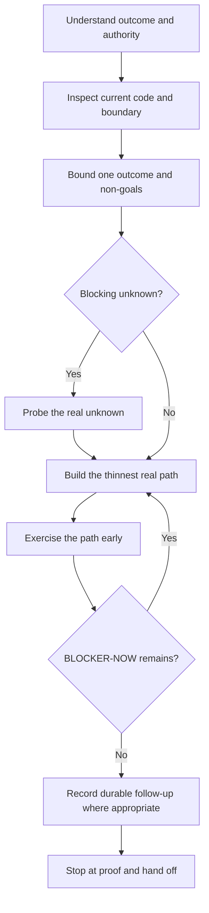

# Work lifecycle



## Understand

Restate the desired observable result, current implementation, scope, non-goals, affected Feature/Component/Contract, and the cheapest credible verification. Inspect rather than assume.

## Implement

Prefer thin vertical slices and reversible edits. For product behavior, reach the real main path early. Do not add a generalized helper, test harness, or scenario script until a concrete repeated need exists.

When test setup is the obstacle, preserve the three-part model:

```text
Topology × Fixture × Test Case
```

Improve the shared environment lifecycle or typed fixtures instead of coupling all three into a new runner.

## Verify

Use the cheapest honest observation that touches the changed risk. Existing deterministic checks are useful supporting signals. Real external runtime paths are explicit opt-in and should only run when the changed boundary needs them.

A command that did not run is not a pass.

## Finish

Review the intended diff for scope, secrets, generated files, task-history residue, stale commands, and false status claims. Stop temporary infrastructure. Transfer non-blocking work to the appropriate issue/roadmap/decision context instead of growing the current slice or committing a handoff report to HEAD.
