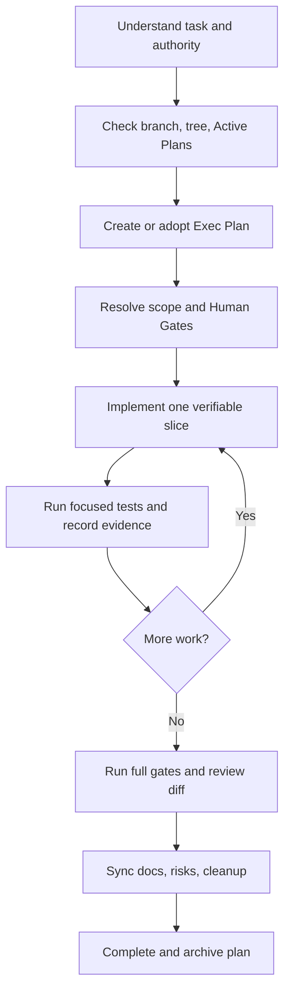

# Work lifecycle

## Understand

Restate the outcome, current state, intended scope, non-goals, affected Feature/Component/Contract, and acceptance evidence. Inspect rather than assume. A bug diagnosis request alone does not authorize an implementation.

## Plan

Substantive work begins with one file under `docs/exec-plans/active/`. Break work into observable outcomes. Include failure and recovery, documentation impact, Human Gates, and actual verification commands. Keep only one next exact action so a new session can resume safely.

## Implement

Prefer thin vertical slices that preserve the dependency rule. Add or adjust a failing focused test when it clarifies a contract. Keep external SDK messages at adapters and avoid speculative generalized infrastructure. Update a completed checkbox immediately; log discoveries and design decisions while they are fresh.

## Verify

Run the closest test after each slice, then the full deterministic gate. When an external boundary changed, run its smoke separately and retain only sanitized ignored evidence. A command that did not run is not a pass. Record failures that informed the implementation, not only the final green command.

## Finish

Review the complete diff for scope, secret/generated files, unsafe error/log content, status claims, and documentation drift. Resolve every plan checkbox. Transfer deferred work explicitly. Move the plan to completed only after the completed-plan checker will pass.
