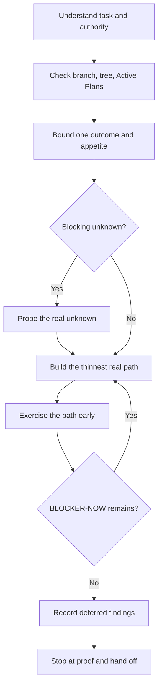

# Work lifecycle

## Understand

Restate the outcome, current state, intended scope, non-goals, affected Feature/Component/Contract, and acceptance evidence. The repository remains in Prove / MVE-first product implementation until the user explicitly changes the stage. The default acceptance target is the smallest complete user-visible/main-flow real E2E, run as early as prerequisites allow. Inspect rather than assume. A bug diagnosis request alone does not authorize an implementation.

## Plan

Bound one observable outcome and appetite before implementation. Use an Exec Plan only when the triggers in the protocol apply; otherwise keep the compact contract in the task context or a task note. Name the representative real path, highest unknown, stop condition, and Human Gates. Do not expand a small slice into a speculative backlog.

## Implement

Prefer thin vertical slices that preserve the dependency rule. For product-behavior changes, run the real main-flow E2E before expanding supporting validation. A documentation-only diff that changes no product behavior may record the E2E as not applicable with the reason. Do not author or expand tests, eval datasets, or fixtures unless the user explicitly requests it or a Human Gate requires them. Keep external SDK messages at adapters and avoid speculative generalized infrastructure. Update a completed checkbox immediately; log discoveries and design decisions while they are fresh.

## Verify

Exercise the representative real path as soon as it becomes viable. Use focused existing checks only when they are cheaper, explicitly requested, or necessary for a Human Gate. A documentation-only diff may record the real path as not applicable. Existing CI is allowed but is not ordinary feature scope. A command that did not run is not a pass.

## Finish

Review the intended diff for scope, secrets, generated files, unsafe output, and false status claims. Transfer non-blocking findings explicitly and stop when the Prove exit condition is met. Archive a plan only when archival is part of this slice; otherwise leave its live state truthful.
