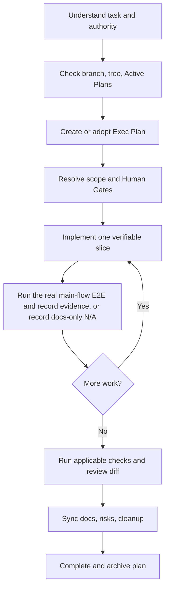

# Work lifecycle

## Understand

Restate the outcome, current state, intended scope, non-goals, affected Feature/Component/Contract, and acceptance evidence. The repository remains in product implementation stage until the user explicitly changes the phase. The default acceptance target is the smallest complete user-visible/main-flow real E2E, run as early as prerequisites allow. Inspect rather than assume. A bug diagnosis request alone does not authorize an implementation.

## Plan

Substantive work begins with one file under `docs/exec-plans/active/`, using only the minimum truthful plan and handoff needed for safe continuation. Break work into observable outcomes and do not let ceremony delay the real main-flow E2E. Include failure and recovery, documentation impact, Human Gates, and actual verification commands. Keep only one next exact action so a new session can resume safely.

## Implement

Prefer thin vertical slices that preserve the dependency rule. For product-behavior changes, run the real main-flow E2E before expanding supporting validation. A documentation-only diff that changes no product behavior may record the E2E as not applicable with the reason. Do not author or expand tests, eval datasets, or fixtures unless the user explicitly requests it. Keep external SDK messages at adapters and avoid speculative generalized infrastructure. Update a completed checkbox immediately; log discoveries and design decisions while they are fresh.

## Verify

Run the real main-flow E2E after each viable product-behavior slice, then only the applicable supporting checks. For a documentation-only diff that changes no product behavior, record why the E2E is not applicable. Existing CI is allowed but is not the default implementation scope or a reason to delay the first real E2E. When product behavior at an external boundary changed, run its smoke separately and retain only sanitized ignored evidence. A command that did not run is not a pass. Record failures that informed the implementation, not only the final green command.

## Finish

Review the complete diff for scope, secret/generated files, unsafe error/log content, status claims, and documentation drift. Resolve every plan checkbox. Transfer deferred work explicitly. Move the plan to completed only after the completed-plan checker will pass.
