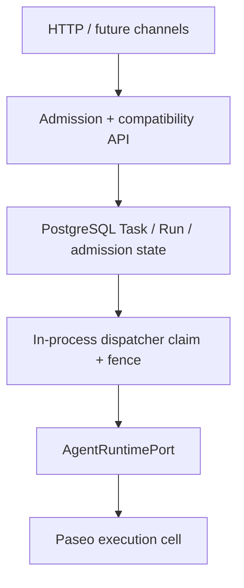

# Architecture

Agent Server follows a ports-and-adapters modular monolith around a separately managed Paseo daemon. The design keeps product truth independent from runtime process state.

Current implementation truth:

- Task is canonical internally; `Run` remains the compatibility HTTP surface.
- Admission, idempotency, Task/Run persistence, and dispatch hints are PostgreSQL-backed.
- One in-process dispatcher claims queued Runs with lease/activation/fence metadata and executes them through `AgentRuntimePort`.
- Reconcile workers, public Task routes, multi-worker coordination, Team orchestration, and tenant/identity scope remain future work.

## Dependency rule

`domain ← application ← adapters/infrastructure/entrypoints`. Domain types never import Hono, Zod, Paseo, filesystem, or storage SDKs. Application code names capabilities through ports. Adapters normalize unstable provider details at the edge.

## Source of truth

- Product and feature scope: [Product](product.md) and [Features](features.md).
- Object invariants: [Domain model](architecture/domain-model.md).
- Runtime ownership and failure semantics: [Execution and recovery](architecture/execution-and-recovery.md).
- Isolation and credentials: [Tenancy and security](architecture/tenancy-and-security.md).
- Concrete public/port shapes: [Contracts](contracts.md).

Architecture changes that alter these boundaries require an ADR and Human Gate.
