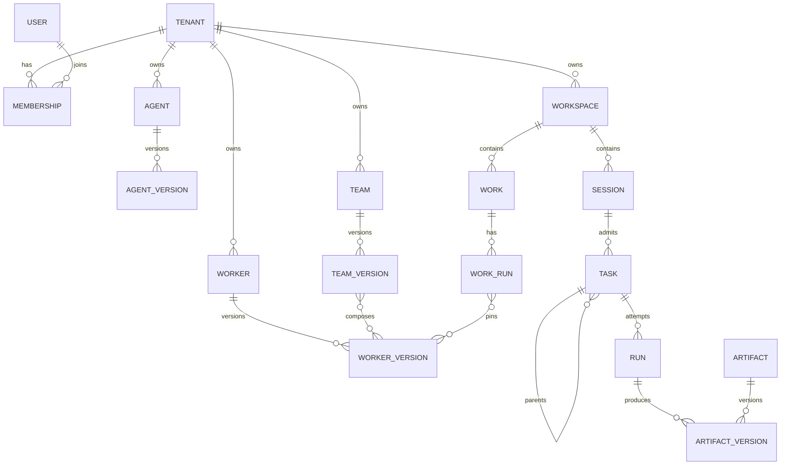

# Domain model

## Core relationships

## Invocation model

The current compatibility Task ingress accepts an immutable Agent or Team
version as an Invokable Version reference. Formal Work execution is converging
on a separate authority: WorkDefinition and TeamVersion composition select
published WorkerVersion refs. Every root or child node invocation is a Task.
The Task records tenant, root/parent genealogy, stable node path/logical step,
spawn generation, depth, immutable invocation reference, input and completion
snapshots, ingress scope/idempotency, and aggregate status. The compatibility
Agent-shaped path must not be read as the target Work model; see [Coworker
Agent / Worker semantic split](../features/coworker-worker-semantic-split.md).

A Run is one attempt for that Task. Waiting for a child or approval resumes the same Run through a new Activation; retry after a terminal attempt creates a new Run. There is no persistent `NodeInvocation` or provider session that competes with Task as identity.

Agent Teams v2 adds durable TeamRun, MemberRun, Work, and TeamMessage
coordination records; they do not replace Task/Run identity. In the target
formal model, a published TeamVersion contains one Lead and a fixed roster of
WorkerVersion refs. `TeamDriver` creates one Lead and fixed roster, then
materializes bounded Lead turns, Worker attempts, and addressed message
continuations as child Tasks/Runs. Each member Task has an independent
RuntimeSession. The Lead can finish only after every Work item is accepted and
no attempt is active. The current migration still contains Agent-shaped Team
compatibility fields; those are legacy until all callers use WorkerVersion.
Dynamic rosters, nested Teams, generalized graph execution, and recovery are
deferred.

## Session boundaries

Product Session is optional conversation continuity and a root-turn lane. Task
can exist without it for child, schedule, or event work. Runtime Session is a
provider context and is bound by Chat or Worker scope, the pinned version,
principal, Workspace, credential policy, and reset generation. A Chat
RuntimeSession and a formal Worker RuntimeSession may share runtime substrate
but do not share product identity or authority. Team members do not share
RuntimeSessions; lead finalization is an independent task-scoped execution
rather than reuse of the lead member binding.

## Artifact model

Artifact is a stable series identity. Each manifest version is immutable and records producer version/Task/Run/node, files, source references, evidence, derived artifacts, completion contract, role, and lifecycle state. Candidate, partial, final, and supersession transitions create new versions/events rather than rewriting history.

## Baseline mapping

[`Run`](../../src/domain/runs/run.ts) still exposes a minimal compatibility resource with five states plus runtime/result/usage/error. Task identity, attempt, activation, fence, and idempotency are now persisted behind the durable admission and repository boundaries rather than returned as public Run fields.
