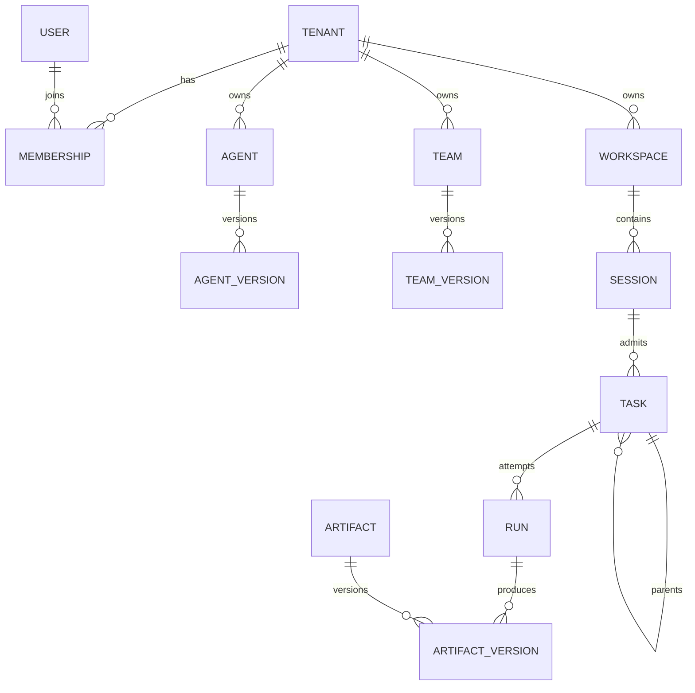

# Domain model

## Core relationships

## Invocation model

Agent Version and Team Version implement one immutable Invokable Version reference. Every root or child node invocation is a Task. The Task records tenant, root/parent genealogy, stable node path/logical step, spawn generation, depth, immutable Invokable version, input and completion snapshots, ingress scope/idempotency, and aggregate status.

A Run is one attempt for that Task. Waiting for a child or approval resumes the same Run through a new Activation; retry after a terminal attempt creates a new Run. There is no persistent `NodeInvocation` or provider session that competes with Task as identity.

Agent Teams v2 adds durable TeamRun, MemberRun, Work, and TeamMessage
coordination records; they do not replace Task/Run identity. `TeamDriver`
creates one Lead and fixed roster, then materializes bounded Lead turns, Work
attempts, and addressed message continuations as child Tasks/Runs. Each member
Task has an independent RuntimeSession. The Lead can finish only after every
Work item is accepted and no attempt is active. Dynamic rosters, nested Teams,
generalized graph execution, and recovery are deferred.

## Session boundaries

Product Session is optional conversation continuity and a root-turn lane. Task can exist without it for child, schedule, or event work. Runtime Session is only a leaf provider context and is bound by product session/node scope, Invokable version, principal, Workspace, credential policy, and reset generation. Team members do not share RuntimeSessions; lead finalization is an independent task-scoped execution rather than reuse of the lead member binding.

## Artifact model

Artifact is a stable series identity. Each manifest version is immutable and records producer version/Task/Run/node, files, source references, evidence, derived artifacts, completion contract, role, and lifecycle state. Candidate, partial, final, and supersession transitions create new versions/events rather than rewriting history.

## Baseline mapping

[`Run`](../../src/domain/runs/run.ts) still exposes a minimal compatibility resource with five states plus runtime/result/usage/error. Task identity, attempt, activation, fence, and idempotency are now persisted behind the durable admission and repository boundaries rather than returned as public Run fields.
