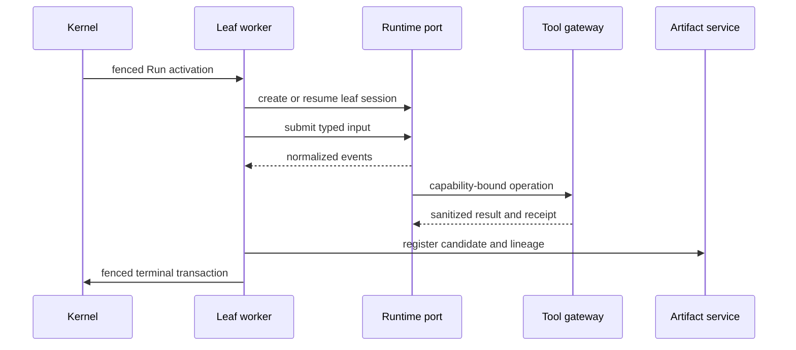

# Execution and recovery

## V1 Run states

```text
created | queued | claimed | starting | running
| waiting_children | awaiting_approval | resume_queued
| cancellation_requested
| succeeded | succeeded_with_warnings | failed | cancelled | timed_out | unknown
```

The baseline implements only `queued → running → succeeded|failed|timed_out` and must not be used to infer durable guarantees.

## Claim and fence

Claim is one atomic database transaction: lock an eligible Run, assign worker/expiry, generate a new unpredictable activation ID, increment fence, revoke old activation grants, and commit. Heartbeat, state, runtime reference, usage, Artifact registration, and terminal completion must match Run, attempt, activation, owner, and fence. A stale worker's events, tokens, terminal writes, and cleanup all fail closed.

## Waiting and resume

When a Team activation waits for children or approval, it persists the exact condition and aggregate version, clears lease/activation authority, revokes capability, commits, and stops. Child completion or approval uses an idempotent route and aggregate-version compare-and-set to move the same Run to `resume_queued`. A new claim creates a new activation and fence.

## Leaf execution



Runtime self-report is not sufficient for success. Completion contract, required artifacts/evidence, security state, and current fence must pass.

## Lease loss and unknown effects

Lease expiry is not a terminal state. Reconciliation checks delivery, committed completion/artifacts, tool/model receipts, runtime timeline, and side-effect classification. A proven read-only/idempotent loss may become `failed(lost_safe_retry)`. An uncertain side effect becomes immutable `unknown(lost_side_effect_uncertain)` and cannot auto-retry.

## Team execution

Team activations read immutable graph IR and idempotently create Child Tasks. Parallel branches do not hold a root session lease. Join uses discriminated published failure policy. Review loops and delegation are bounded and feature-gated. Root cancel stops new child creation and propagates through active descendants.
