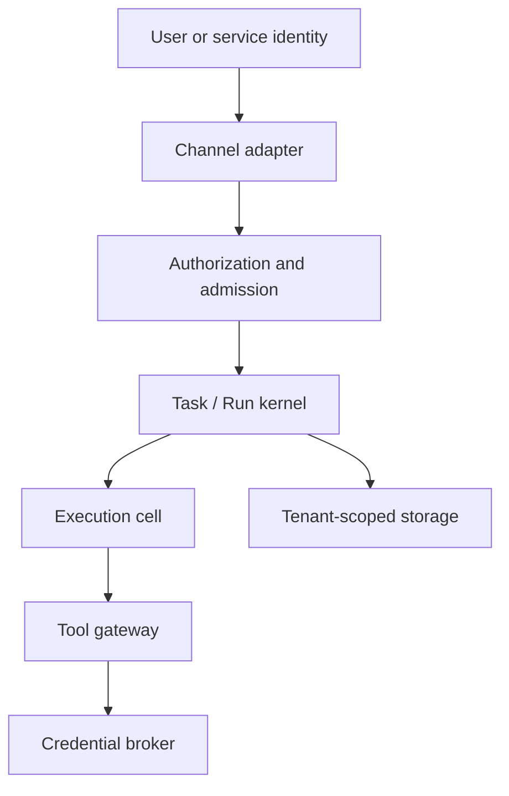

# Tenancy and security

## Trust boundaries

External identity, runtime process identity, effective principal, and service identity are distinct. A caller supplies credentials to authenticate, never an authoritative tenant, parent/fence, or effective principal.

## Tenant isolation

Every business aggregate carries tenant identity and is authorized before use. Storage enforces tenant isolation in addition to application checks. Child Tasks remain in the root tenant. Execution placement separates writable homes and runtime/provider state by isolation profile; restricted work cannot share a writable provider home with another tenant.

## Credential boundary

Business credentials remain in a broker or upstream authorization server. Agent definitions and prompts contain only profiles/references. Runtime provider infrastructure credentials require short-lived injection, proxying, or cell isolation and cannot be exposed through prompt, tools, workspace, ordinary shell, log, or result.

Every tool call validates an audience-bound capability against current Run/fence, principal, allowed operation, credential policy, approval, and revocation generation. Budget is maintained in an atomic ledger, not trusted from a token field.

## Baseline truth

The baseline now enforces one real ingress boundary on the Run compatibility API:

- `POST /api/v1/runs` and `GET /api/v1/runs/{id}` require a configured service-account bearer token;
- tenant, workspace, and principal scope are resolved from that authenticated binding, not caller-supplied fields;
- root Task admission persists those snapshot facts and idempotency replay is scoped to that owner;
- authenticated reads outside the stored owner scope return `404 run_not_found`.

This is still not full Phase 2 security. The baseline does not yet provide end-user OIDC, shared Workspace ACLs, credential broker enforcement, approval flows, storage-wide tenant isolation guarantees, or execution-cell filesystem/network isolation. It must not process customer data or production credentials. Its zero-model-credential test demonstrates installation convenience, not enterprise isolation.

## Required security tests

- cross-tenant identifiers and storage access;
- stale activation/fence and revoked capability;
- private credential use by another user, shared session, or child;
- secret scanning of prompt, workspace, logs, events, API, tool result, and Artifact;
- high-risk approval bypass, replay, expiry, and approver authorization;
- metadata/host-socket/network escape from execution placement;
- cancel/retry after non-repeatable or unknown side effects.
