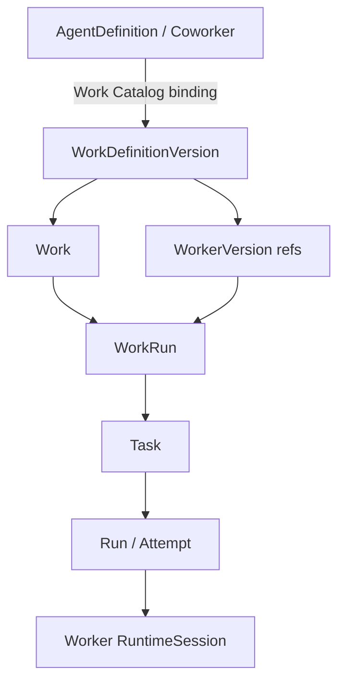

# Coworker Agent / Worker semantic split

Status: active cutover complete; historical compatibility isolated

This document is the durable repository navigation point for the formal
separation between the long-lived Coworker product and formal Work execution.
The active Product path now uses Worker identity end to end. Agent-shaped Work
records survive only where historical migration/audit evidence or the explicit
technical direct-Agent Task compatibility surface requires them.

Related authority in this repository:

- [Domain model](../architecture/domain-model.md) — durable identity and execution vocabulary.
- [Work Definition API](../contracts/work-definition-api.md) — Product Work authoring and admission boundary.
- [Agent Teams v2 API](../contracts/agent-team-api.md) — formal collaboration lifecycle and Team projections.
- [Coworker Chat contract](../contracts/coworker-chat.md) — Chat identity, roster, and Chat runtime lifecycle.
- [Control Plane component](../components/control-plane.md) — ownership of durable definitions, policy, and execution decisions.
- [Workspace and Artifact Store](../components/workspace-and-artifact-store.md) — Product Workspace and execution filesystem boundary.

## One-sentence rule

`AgentDefinition` / `AgentVersion` own the user-visible Coworker and Chat
relationship. `WorkerDefinition` / `WorkerVersion` own formal execution. A Work
composition selects Worker versions; it never turns a Coworker into an implicit
Worker, and publishing a Worker never creates or changes a Chat relationship.

An explicit Work Catalog binding may expose one or more WorkDefinitions as a
Coworker's formal capabilities. That binding is discoverability/admission
policy; it does not make the AgentVersion the execution authority. The selected
WorkDefinition and immutable WorkerVersion snapshot own formal execution.

## Object ownership and lifecycle

| Object | Product meaning | Lifecycle owner | Versioning rule | Conversation roster? |
| --- | --- | --- | --- | --- |
| `AgentDefinition` | Long-lived Coworker identity | Coworker / Chat plane | Stable identity | Yes |
| `AgentVersion` | Immutable Coworker behavior/configuration | Coworker / Chat plane | Draft publishes once; published immutable | Indirectly via AgentDefinition |
| `WorkerDefinition` | Reusable formal execution role | Work / execution plane | Stable execution identity | No |
| `WorkerVersion` | Immutable executable Worker snapshot | Work / execution plane | Draft publishes once; published immutable | No |
| `WorkDefinition` | Formal job/workflow contract | Product Work plane | Published versions immutable | No |
| `TeamDefinition` / `TeamVersion` | Formal collaboration composition | Work / execution plane | TeamVersion pins WorkerVersion refs | No |
| `Work` | Durable user order | Product Work plane | Stable Work identity | No |
| `WorkRun` | One execution occurrence | Product Work plane | Pins input + exact resource snapshot | No |
| `Task` / `Run` / `Attempt` | Technical execution facts | Orchestration kernel | Retry/history append-only | No |
| `RuntimeSession` | Replaceable provider/runtime binding | Runtime boundary | Never product identity | No |

The Worker v1 package grammar may reuse hardened executable parsing that was
first introduced for managed Agents. Shared parsing is implementation reuse,
not shared product identity, ownership, permission, lifecycle, or publication
semantics.

## Active formal execution chain



At admission, the server resolves only published Worker versions in the exact
authenticated owner scope, plus the required Environment, Memory, Skill, Tool,
and platform capability versions. It records the resolved manifest on the
WorkRun before technical Task admission. Registry heads are never implicit
inputs to retries or replay.

### Pinning, retries, and replay

- A Work selects a Definition lineage and current immutable DefinitionVersion.
- A WorkRun pins the exact WorkerVersion(s), input, policies, and capabilities used for that occurrence.
- Every Task carries an immutable invocation reference and genealogy.
- A retry/rework keeps the WorkRun snapshot; it does not upgrade Worker versions or rewrite history.
- A new Worker publication affects only future admissions that explicitly select it.

## Team composition

Formal collaboration is composition over immutable Worker references:

```text
TeamVersion
├── lead: WorkerVersion reference
├── roster: named WorkerVersion references
└── environment/collaboration policy snapshot
```

The Team roster is an execution composition, not a Conversation roster. Team
members therefore do not become Coworkers and do not receive Direct
Conversations merely because they participate in Work.

## Coworker roster and Chat

The Coworker roster exposes canonical `AgentDefinition` identities. A Direct
Conversation selects that stable Coworker and its Chat runtime epoch. A Chat
message may reference a Work, but that is a product link, not a Worker roster
entry.

Worker publication has no Chat side effect:

- no `AgentChatRuntime` is created or changed;
- no Direct Conversation is created;
- no Worker appears in `GET /api/v1/agents`;
- no Coworker active version or Chat epoch changes.

Chat and Worker execution share the durable RuntimeSession substrate, but use
different runtime subjects, scope, authorization, version pins, context views,
and recovery semantics.

## Work Catalog binding invariant

An enabled Agent Work Catalog entry is one exact relationship:

```text
Coworker AgentDefinition
  -> WorkDefinition
  -> published WorkDefinitionVersion of that same lineage and owner scope
```

The database and repository enforce the Definition/Version lineage. Listing a
catalog cannot combine metadata from one Definition with a Version from another
Definition or owner.

## Owner and execution context

Every formal Worker and Work resource is authorized from server-derived
context. Worker execution authority is scoped by all four dimensions:

```text
tenant + workspace + principal type + principal id
```

Name convergence, idempotency, import, publish, exact version resolution, and
formal Work participant resolution use the same scope. A tenant-only lookup is
not sufficient for admission or execution authorization.

Context/VFS follows product ownership rather than provider process identity.
Chat views mount Coworker/Conversation scopes; Worker views mount Work/execution
scopes. Neither side inherits the other's private scope merely because names or
provider sessions match.

## Historical migration compatibility

Migrations 0058–0061 preserve and repair old data while establishing one active
authority:

1. 0058 created Worker identities and copied historical executable snapshots so durable execution references could be cut over without fabricating new package history.
2. 0059 switched active Team/Runtime Work identities to Worker references and introduced Agent Work Catalog bindings.
3. 0060 classified accidental historical work-internal Agents and removed their Chat/runtime projections.
4. 0061 closes exact Worker owner scope, DefinitionVersion catalog lineage, and orphan wake rows left by historical Conversation cleanup.

Historical `single_agent` / `agent_version_id` values may appear in old migration
SQL, audit rows, or explicitly named migration fixtures. They are not accepted
as the current Product WorkDefinition vocabulary.

The technical `POST /api/v1/tasks:invoke` compatibility surface may still admit
an explicit legacy Agent invokable for old non-Product clients. That seam does
not participate in WorkDefinition composition and must not be used as a second
formal Work authority.

## Active invariants

Forbidden in active Product Work code:

- importing/publishing an Agent to materialize a Work participant;
- AgentVersion fallback when WorkerVersion is missing;
- two active identities for one execution slot;
- WorkDefinition authoring using Agent participant fields;
- retry/replay resolving the latest registry head rather than the pinned WorkRun snapshot;
- Worker publication provisioning Chat;
- Work Catalog bindings that do not prove exact DefinitionVersion lineage and owner scope.

A repository compatibility gate protects the WorkDefinition authoring/client
surfaces from reintroducing obsolete Agent-shaped Work composition vocabulary.

## Current baseline and next product work

| Area | Current state | Next Feature work |
| --- | --- | --- |
| Worker identity | Active cutover complete; exact owner scope | Product Worker authoring UX only when needed |
| Work composition | `single_worker` and bounded collaboration are canonical | Generalized composition only from real demand |
| Team roster | WorkerVersion-only active authority | Dynamic/nested Teams deferred |
| Work snapshot | Worker/input/resources pinned before Task admission | Richer retry/recovery receipts later |
| Coworker Chat | Agent-owned, isolated from Worker publication | Work Catalog / Coworker capability UX |
| Context/VFS | Separate Chat and Work views | Broader production isolation later |
| Deliverables | Result text/trace exist | Artifact & Evidence MVE |

The semantic foundation is considered closed for MVE Feature development. New
structural Agent/Worker refactors require a concrete product need rather than a
cleanup preference.
