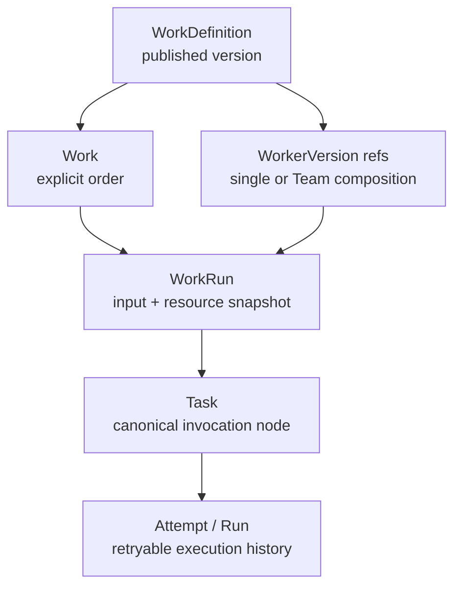

# Coworker Agent / Worker semantic split

Status: cutover in progress

This document is the durable repository navigation point for the formal
separation between the long-lived Coworker product and formal Work execution.
It records the target object model, the invariants that a cutover must preserve,
and the boundary between the current compatibility baseline and the required
future shape. It does not claim that the current Work caller path has already
been migrated.

Related authority in this repository:

- [Domain model](../architecture/domain-model.md) — durable identity and
  execution vocabulary.
- [Work Definition API](../contracts/work-definition-api.md) — Product Work
  authoring and admission boundary.
- [Agent Teams v2 API](../contracts/agent-team-api.md) — formal collaboration
  lifecycle and Team projections.
- [Coworker Chat contract](../contracts/coworker-chat.md) — Chat identity,
  roster, and Chat runtime lifecycle.
- [Control Plane component](../components/control-plane.md) — ownership of
  durable definitions, policy, and execution decisions.
- [Workspace and Artifact Store](../components/workspace-and-artifact-store.md)
  — Product Workspace and execution filesystem boundary.

## One-sentence rule

`AgentDefinition` / `AgentVersion` own the user-visible Coworker and Chat
relationship. `WorkerDefinition` / `WorkerVersion` own formal execution. A
Work composition selects Worker versions; it does not turn a Coworker into an
implicit Worker, and publishing a Worker never creates or changes a Chat
relationship.

An explicit Work Catalog binding may expose one or more WorkDefinitions as a
Coworker's available formal capabilities. That binding is discoverability and
admission policy; it does not make the AgentVersion the execution authority.
The selected WorkDefinition and WorkerVersion snapshot still own formal
execution.

## Object ownership and lifecycle

| Object                           | Product meaning                                                  | Owner of lifecycle     | Versioning rule                                            | May appear in Conversation roster?       |
| -------------------------------- | ---------------------------------------------------------------- | ---------------------- | ---------------------------------------------------------- | ---------------------------------------- |
| `AgentDefinition`                | Long-lived Coworker identity and Chat relationship               | Coworker / Chat plane  | Stable identity; versions are immutable snapshots          | Yes                                      |
| `AgentVersion`                   | Immutable Coworker behavior/configuration snapshot               | Coworker / Chat plane  | Draft may publish once; published content is immutable     | Indirectly, through its Agent definition |
| `WorkerDefinition`               | Reusable formal execution role                                   | Work / execution plane | Stable execution identity                                  | No                                       |
| `WorkerVersion`                  | Immutable executable Worker snapshot                             | Work / execution plane | Draft may publish once; published content is immutable     | No                                       |
| `WorkDefinition`                 | A formal job/workflow contract                                   | Product Work plane     | Each published version is immutable                        | No                                       |
| `TeamDefinition` / `TeamVersion` | Formal collaboration composition                                 | Work / execution plane | TeamVersion pins named WorkerVersion refs and is immutable | No                                       |
| `Work`                           | Explicit user-created order, independent of a Definition version | Product Work plane     | Stable Work identity; each Run pins its own version        | No                                       |
| `WorkRun`                        | One execution occurrence of a Work                               | Product Work plane     | Immutable input and resolved-resource snapshot             | No                                       |
| `Task` / `Run` / `Attempt`       | Technical invocation, attempt, and activation facts              | Orchestration kernel   | Retry creates a new attempt; history is append-only        | No                                       |
| `RuntimeSession`                 | Provider/runtime binding for Chat or formal execution            | Runtime boundary       | Replaceable binding; never product identity                | No                                       |

`WorkerDefinition` and `WorkerVersion` are formal execution resources even when
their v1 package grammar reuses the hardened executable package parser that was
first used for managed Agents. Stable executable fingerprints may therefore be
preserved during migration, but shared package parsing does not merge ownership,
permissions, lifecycle, or product identity.

## Formal execution chain

The target chain is explicit at every durable boundary:



At admission, the server resolves only published, owner-authorized
`WorkerVersion` references (and the required Environment, Memory, Skill, Tool,
and platform capability versions). It persists a resolved resource manifest on
the WorkRun before admitting the technical root Task. The manifest is the
execution snapshot; a current registry head is not an implicit input.

### Pinning, retries, and replay

- A Work selects a Definition lineage; each WorkRun pins one immutable
  WorkDefinition version.
- A WorkRun pins the exact WorkerVersion(s), policies, capabilities, and typed
  input snapshot used for that occurrence.
- Every Task carries its immutable invocation reference and genealogy. A Run is
  one attempt; an Attempt/Activation is one bounded ownership period within
  that attempt.
- A retry creates a new attempt under the same WorkRun and snapshot. It does
  not resolve the latest WorkerVersion, replace the WorkDefinition version, or
  rewrite prior attempts.
- Replay and recovery read the persisted snapshot. They must not silently
  upgrade to a newly published WorkerVersion or infer a Worker from a Chat
  roster entry.
- A new Worker publication affects only future admissions that explicitly
  select it. It cannot mutate an in-flight WorkRun or historical trace.

## Team composition

Formal collaboration is composition over immutable Worker references:

```text
TeamVersion
├── lead: WorkerVersion reference
├── roster: named WorkerVersion references
└── environment/collaboration policy snapshot
```

The roster is an execution composition, not a Conversation roster. Team
membership therefore carries WorkerVersion identity, role/name, owner scope,
and the versioned execution policy needed by the TeamRun. It must not carry an
`AgentVersion` fallback as a second authority.

The Team driver may create bounded lead turns, Worker attempts, and addressed
continuations as child Tasks/Runs. Each member may have an independent
RuntimeSession. A shared provider substrate is an implementation detail; it
does not make Team members Coworkers or make the Team a Chat conversation.

## Coworker roster and Chat

The Coworker roster is the published `AgentDefinition` relationship exposed by
the Chat plane. A Conversation selects that stable Coworker identity and its
Chat runtime epoch. A Chat message may reference a Work projection, but that
reference is a product link, not a Worker roster entry.

Worker publication has no Chat side effect:

- it must not create an `AgentChatRuntime`;
- it must not create or reconcile a Direct Conversation;
- it must not add a Worker to `GET /api/v1/agents` or a browser Coworker roster;
- it must not change a Coworker active version or Chat epoch.

Agent publication may continue to provision the Coworker Chat relationship on
the current Chat MVE. That lifecycle is intentionally separate from Worker
publication. Chat and formal Worker RuntimeSessions may share provider/runtime
substrate, but they have different scope, authorization, version pin, and
recovery semantics.

## Owner, actor, and execution context

Every formal Work resource is authorized from server-derived context. The
following dimensions are explicit and must not be inferred from a package or
runtime identity:

| Context          | Meaning                                                       | Boundary                                                                            |
| ---------------- | ------------------------------------------------------------- | ----------------------------------------------------------------------------------- |
| Tenant           | Security and storage partition                                | Every resource and lookup is tenant-scoped                                          |
| User / principal | Authenticated human user or service principal                 | Supplies the request identity; current MVE uses configured service-account bindings |
| Owner            | Durable creator/owner scope for a Work, Definition, or Worker | Derived from authenticated request; never caller-selected                           |
| Actor            | User or service principal performing the current command      | Recorded for authorization/audit where supported; not substituted for Owner         |
| Chat             | Conversation relationship and Chat runtime epoch              | Owns Coworker messages and Chat continuity only                                     |
| Run              | One WorkRun/Task/Attempt execution occurrence                 | Owns execution snapshot, trace, and retry history                                   |
| Context/VFS      | Mounted product scopes visible to one view                    | Mounts are explicit and capability-bound                                            |

The VFS boundary follows product ownership, not whichever Agent or provider
process happens to execute a turn. A formal Worker view may mount the selected
Work scope, immutable input, approved Workspace/Organization context, and
run-scoped scratch according to policy. It must not receive another tenant's
data, a Coworker's private home merely because the names match, control-plane
credentials, provider secrets, or an arbitrary host path. Chat views use Chat
and Coworker scopes; Worker views use Work and execution scopes. Local paths
are never public identity or response fields.

## Cutover and migration rules

The migration is a namespace and authority split, not a rename-only exercise.

1. Keep historical Agent and Chat identity intact. Copy/derive Worker registry
   rows with stable IDs and fingerprints where the migration explicitly
   requires historical execution continuity.
2. Convert formal Work source and Team composition to Worker vocabulary:
   `single_worker` + `workerVersionId` / `worker_version_id`, and Team lead and
   roster entries that reference WorkerVersion IDs.
3. Resolve and persist WorkerVersion refs in WorkRun manifests, TeamRuns,
   member attempts, and replay paths. New formal execution must fail closed if
   the Worker reference is missing, foreign, draft, or outside the pinned
   lineage.
4. Keep compatibility readers/writers narrow and observable. A legacy
   `single_agent` / `agentVersionId` row may be read only while migration is
   active and must be classified as legacy; it is not a second active semantic
   authority.
5. Remove active Work callers that import or publish an Agent solely to make a
   formal Worker executable. Worker import/publish must remain Worker-only and
   must not call Coworker provisioning.
6. Once all real callers use Worker refs, remove the legacy fallback and any
   nullable bridge columns or dual-write paths that allow Agent and Worker
   meanings to diverge. Historical data may retain an explicit migration
   marker, but it must not be reinterpreted as a current Agent roster entry.

Forbidden shapes:

- implicit Agent materialization or Agent publication during Work/Team
  admission;
- AgentVersion roster fallback when a WorkerVersion is absent;
- two active authorities for the same formal execution slot;
- a fake nullable `agent_version_id`/`worker_version_id` bridge that lets either
  identity silently win;
- identity inference from provider session IDs, runtime process IDs, package
  names, Conversation membership, or filesystem paths;
- Worker publication that provisions Chat, or Coworker publication that silently
  creates a formal Work execution binding;
- retry/replay that reloads the current registry head instead of the pinned
  snapshot.

## Baseline, cutover, and deferred checklist

| Area               | Current baseline                                                                                                                              | Required by cutover                                                                                                  | Deferred after this cutover                                   |
| ------------------ | --------------------------------------------------------------------------------------------------------------------------------------------- | -------------------------------------------------------------------------------------------------------------------- | ------------------------------------------------------------- |
| Worker identity    | `WorkerDefinition` / `WorkerVersion` domain and registry scaffolding exists; migration 0058 creates/copies Worker rows and adds Worker fields | Worker is the only formal execution authority in active Work and Team callers                                        | Broader Worker marketplace/sharing and public lifecycle UX    |
| Work composition   | **Incomplete:** active composition still exposes `single_agent` and `agentVersionId`; some paths may import/publish Agents                    | WorkDefinition and resolved IR use WorkerVersion refs; no Agent materialization or publish side effect               | Generalized DAGs, nested Teams, dynamic rosters               |
| Team roster        | Migration scaffolding converts stored Team specs toward Worker refs, while compatibility code still contains Agent-shaped fields              | TeamVersion and member execution records use WorkerVersion refs with one authority                                   | Dynamic membership and generalized graph scheduling           |
| Snapshot semantics | Product WorkRun and technical Task/Run snapshots exist in the baseline                                                                        | Worker refs, input, capabilities, and policy are pinned before Task admission; retries/replay never upgrade          | Full crash recovery, richer receipts, production retry policy |
| Coworker Chat      | Agent roster, Chat runtime, and publication provisioning are implemented MVE behavior                                                         | Worker lifecycle is isolated and has no Chat side effect; Chat remains Agent-owned                                   | Chat/Worker identity unification (not planned)                |
| Context/VFS        | Context scopes and run-scoped filesystem concepts exist, with production isolation still limited                                              | Owner/actor/tenant/chat/run scopes are explicit and Worker mounts are policy-bound                                   | Full FUSE expansion, production isolation, credential broker  |
| Verification       | Focused Worker domain/registry/migration checks exist where implemented                                                                       | Exercise at least one real Work caller, one Team caller, retry/replay pinning, and no-publication Chat negative path | Broad acceptance, multi-user hardening, performance work      |

The important status statement is deliberate: the baseline has the Worker
scaffold and migration, but active Work composition cutover is incomplete.
Until the required callers and snapshots are switched, documentation and
contracts must label Agent-shaped Work fields as legacy compatibility rather
than presenting them as the formal Worker model.

## Out of scope for this document

This split does not redesign the Web shell, provider selection, Artifact
product, scheduling, billing, or the broader identity/membership model. Those
features may consume the explicit boundaries above, but they do not redefine
which object owns Coworker Chat versus formal Work execution.
