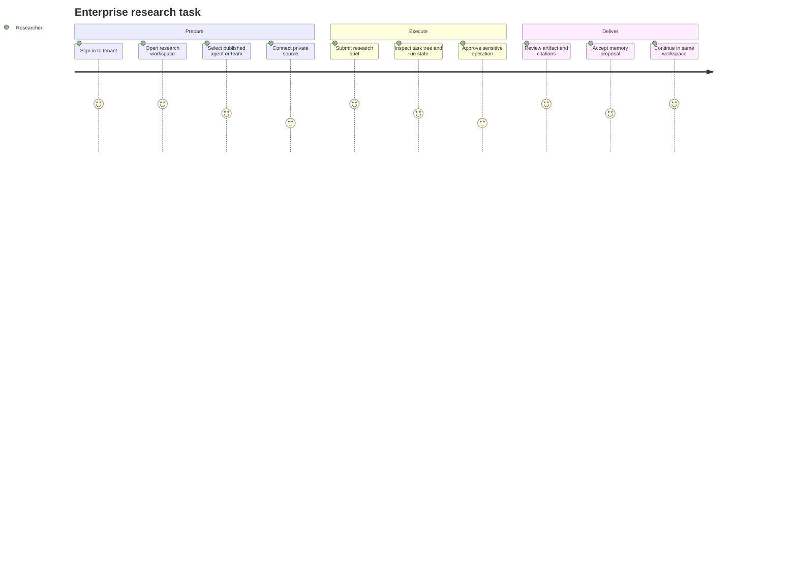

# Users and journeys

## Researcher journey

Success means the accepted brief is never silently lost, the user can understand what version and authority executed it, and the result remains useful outside the chat transcript.

## Research lead journey

The lead drafts and publishes immutable Agent/Team versions, assigns them to workspaces, defines completion and failure policy, compares single-Agent and Team outcomes, and audits child work. A published version cannot be mutated under an existing Task. A retry keeps its history and identifies which child results were reused or regenerated.

## Platform administrator journey

The administrator connects identity providers, grants tenant/workspace roles, manages service accounts, configures isolation and credential providers, inspects audit trails, and drains unhealthy runtime pools. External identity identifiers never become business-object primary keys.

## Developer-platform journey

An internal service submits an idempotent Task proposal through the API and polls or subscribes to normalized events. It does not create Paseo sessions, choose worker activations, forge principals, or pass provider secrets. Lark and Web use the same Task admission contract.

In the current workspace-memory baseline, an authenticated service can also propose durable Workspace memory, attach optional Task/session provenance, review the proposal, and list accepted entries. This proves the governance loop only. The agent runtime does not retrieve those entries or receive them as injected context.

## Baseline developer journey

The repository baseline proves the smallest developer loop:

1. `make setup` installs exact Paseo/OpenCode versions.
2. `make ci` validates the platform-independent contracts.
3. `make dev` starts an isolated local runtime and API.
4. `POST /api/v1/runs` returns `202` and a stable Run URL.
5. Polling returns an explicit terminal result.
6. Workspace-memory proposal routes create, review, and list accepted records under the authenticated owner scope.
7. `make paseo-smoke` proves the same seam against a live free model without model credentials.

This baseline journey is infrastructure evidence. It is not the end-user V1 workflow.
