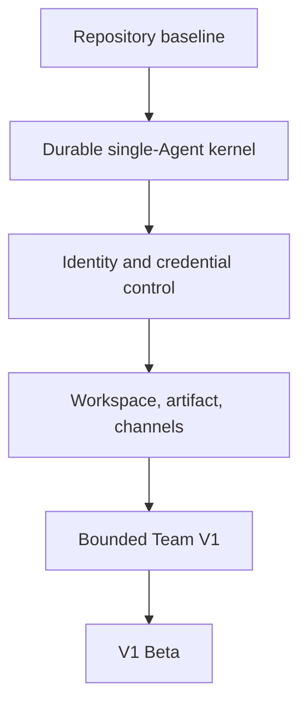

# Roadmap

## Phase 0 — repository baseline

Establish agent-readable authority, deterministic gates, a replaceable Runtime Port, minimal asynchronous API, local process lifecycle, and live zero-model-credential smoke. This phase is implemented by the initial baseline Exec Plan.

## Phase 1 — durable single-Agent kernel

Replace the in-memory Run repository and callback with PostgreSQL-backed Task/Run admission, outbox/queue, atomic claim, lease, activation/fence, event normalization, cancel, retry, reconciliation, and unknown-side-effect policy. Introduce idempotency before any channel integration.

## Phase 2 — identity, credentials, and isolation

Add tenant/user/membership, Workspace ACL, service accounts, workload identity, credential broker, tool profiles, policy decisions, approvals, audit, and execution-cell placement. Threat-model and test cross-tenant and stale-activation behavior before real private data.

## Phase 3 — workspace, artifacts, and channels

Add product Workspace/source snapshots, Product Session, immutable Artifact/Evidence versions, Web/API Task review, Lark ingress/delivery, and operations dashboards. Keep all channels on the same Task proposal path.

## Phase 4 — bounded Team V1

Add immutable Team versions, compiler/IR, child Task genealogy, sequential and parallel-plus-join execution, human approval, bounded nesting, root budget/cancel/retry, and root Artifact lineage. Complete the Team release gates before Beta.

## Later

Enable Manager-worker delegation, bounded review loops, schedules, event triggers, richer memory and document rendering only behind explicit feature contracts and fallback controls. Multi-runtime routing and ambient proactive discovery remain post-V1.
